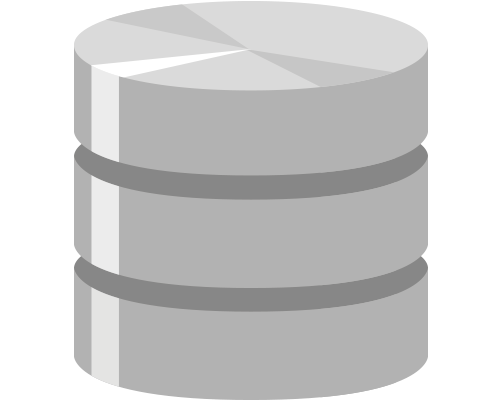

 

  

 

  <a href="https://academy.dqlab.id/main/module">DQLab</a> adalah salah satu portal belajar Data Science terbaik di Indonesia. Banyak modul yang disediakan seperti, R, Python, dan SQL. Ketiga bahasa tersebut sangat umum digunakan di dunia Data Science. 

 

<h1 align="center">DQLab Modules</h1>

## R Module 

Daftar Kelas

- [[📂](https://github.com/MyArist/DQLab/tree/master/Learn/R/Preliminary/Introduction%20to%20Data%20Science%20with%20R)] [[🔍](https://academy.dqlab.id/main/package/practice/111)] [[📃](https://academy.dqlab.id/certificate/pdf/DQLABBGINRUSPHOS)] Introduction to Data Science with R

- [[📂](https://github.com/MyArist/DQLab/tree/master/Learn/R/Preliminary/R%20Fundamental%20for%20Data%20Science)] [[🔍](https://academy.dqlab.id/main/package/practice/1)] [[📃](https://academy.dqlab.id/certificate/pdf/DQLABINTR1CLGENH)] R Fundamental for Data Science

## Python Module 

Daftar Kelas

- [[🗂️](https://github.com/hilmireza09/DQLab/blob/main/python/1_Python%20for%20Data%20Professional%20Beginner%20-%20Part%201.ipynb)] Python for Data Professional Beginner - Part 1

- [[🗂️](https://github.com/hilmireza09/DQLab/blob/main/python/2_Python%20for%20Data%20Professional%20Beginner%20-%20Part%202.ipynb)] Python for Data Professional Beginner - Part 2

- [[🗂️](https://github.com/hilmireza09/DQLab/blob/main/python/3_Python%20for%20Data%20Professional%20Beginner%20-%20Part%203.ipynb)] Python for Data Professional Beginner - Part 3

- [[🗂️](https://github.com/hilmireza09/DQLab/blob/main/python/4_Exploratory%20Data%20Analysis%20with%20Python%20for%20Beginner.ipynb)] Exploratory Data Analysis with Python for Beginner

- [[🗂️](https://github.com/hilmireza09/DQLab/blob/main/python/5_Data%20Visualization%20with%20Python%20Matplotlib%20for%20Beginner%20-%20Part%201.ipynb)] Data Visualization with Python Matplotlib for Beginner - Part 1

- [[🗂️](https://github.com/hilmireza09/DQLab/blob/main/python/6_Data%20Visualization%20with%20Python%20Matplotlib%20for%20Beginner%20-%20Part%202.ipynb)] Data Visualization with Python Matplotlib for Beginner - Part 2

- [[🗂️](https://github.com/hilmireza09/DQLab/blob/main/python/7_%20Data%20Quality%20with%20Python%20for%20Beginner.ipynb)] Data Quality with Python for Beginner

- [[🗂️](https://github.com/hilmireza09/DQLab/blob/main/python/8_Machine%20Learning%20With%20Python%20for%20Beginner.ipynb)] Machine Learning With Python for Beginner

- [[🗂️](https://github.com/hilmireza09/DQLab/blob/main/python/9_Fundamental%20Data%20Visualization%20with%20Python.ipynb)] Fundamental Data Visualization with Python

- [[🗂️](https://github.com/hilmireza09/DQLab/blob/main/python/10_Data%20Manipulation%20with%20Pandas%20-%20Part%201.ipynb)] Data Manipulation with Pandas - Part 1

- [[🗂️](https://github.com/hilmireza09/DQLab/blob/main/python/11_Data%20Manipulation%20with%20Pandas%20-%20Part%202.ipynb)] Data Manipulation with Pandas - Part 2

- [[🗂️](https://github.com/hilmireza09/DQLab/blob/main/python/12_Statistic%20using%20Python%20for%20Data%20Science%20-%20Part%201.ipynb)] Statistic using Python for Data Science - Part 1

- [[🗂️](https://github.com/hilmireza09/DQLab/blob/main/python/13_Statistic%20using%20Python%20for%20Data%20Science%20-%20Part%202.ipynb)] Statistic using Python for Data Science - Part 2

- [[🗂️](https://github.com/hilmireza09/DQLab/blob/main/python/14_Data%20Visualization%20using%20Plotnine.ipynb)] Data Visualization using Plotnine

## SQL Module 

Daftar Kelas

- [[🗂️](https://github.com/hilmireza09/DQLab/blob/main/sql/1_Fundamental%20SQL%20Using%20SELECT%20Statement.sql)] Fundamental SQL Using SELECT Statement

- [[🗂️](https://github.com/hilmireza09/DQLab/blob/main/sql/2_Fundamental%20SQL%20Using%20FUNCTION%20and%20GROUP%20BY.sql)] Fundamental SQL Using FUNCTION and GROUP BY

- [[🗂️](https://github.com/hilmireza09/DQLab/blob/main/sql/3_Fundamental%20SQL%20Using%20INNER%20JOIN%20and%20UNION.sql)] Fundamental SQL Using INNER JOIN and UNION

- [[🗂️](https://github.com/hilmireza09/DQLab/blob/main/sql/4_Fundamental%20SQL%20Group%20By%20and%20Having.sql)] Fundamental SQL Group By and Having

- [[🗂️](https://github.com/hilmireza09/DQLab/blob/main/sql/5_Project%20Fundamental%20SQL%20Group%20By%20and%20Having.sql)] Project Fundamental SQL Group By and Having

<h1 align="center">DQLab Project</h1>

## R Project 

Daftar Project

- [[🗂️](https://github.com/hilmireza09/DQLab/blob/main/sql/5_Project%20Fundamental%20SQL%20Group%20By%20and%20Having.sql)] Project Fundamental SQL Group By and Having

## Python Project 

Daftar Project

- [[🗂️](https://github.com/hilmireza09/DQLab/blob/main/python/Project/1_Data%20Science%20Challenge%20with%20Python.ipynb)] Data Science Challenge with Python

- [[🗂️](https://github.com/hilmireza09/DQLab/blob/main/python/Project/2_Data%20Engineer%20Challenge%20with%20Python.ipynb)] Data Engineer Challenge with Python

- [[🗂️](https://github.com/hilmireza09/DQLab/blob/main/python/Project/3_Project%20Machine%20Learning%20with%20Python%20Building%20Recommender%20System.ipynb)] Project Machine Learning with Python Building Recommender System

- [[🗂️](https://github.com/hilmireza09/DQLab/blob/main/python/Project/4_Project%20Machine%20Learning%20with%20Python%20Building%20Recommender%20System%20with%20Similarity%20Function.ipynb)] Project Machine Learning with Python Building Recommender System with Similarity Function

- [[🗂️](https://github.com/hilmireza09/DQLab/blob/main/python/Project/5_Project%20Simple%20ETL%20with%20Pandas.ipynb)] Project Simple ETL with Pandas

## SQL Project 

Daftar Project

- [[🗂️](https://github.com/hilmireza09/DQLab/blob/main/sql/1_Fundamental%20SQL%20Using%20SELECT%20Statement.sql)] Fundamental SQL Using SELECT Statement

- [[🗂️](https://github.com/hilmireza09/DQLab/blob/main/sql/2_Fundamental%20SQL%20Using%20FUNCTION%20and%20GROUP%20BY.sql)] Fundamental SQL Using FUNCTION and GROUP BY

- [[🗂️](https://github.com/hilmireza09/DQLab/blob/main/sql/3_Fundamental%20SQL%20Using%20INNER%20JOIN%20and%20UNION.sql)] Fundamental SQL Using INNER JOIN and UNION

- [[🗂️](https://github.com/hilmireza09/DQLab/blob/main/sql/4_Fundamental%20SQL%20Group%20By%20and%20Having.sql)] Fundamental SQL Group By and Having

- [[🗂️](https://github.com/hilmireza09/DQLab/blob/main/sql/5_Project%20Fundamental%20SQL%20Group%20By%20and%20Having.sql)] Project Fundamental SQL Group By and Having

